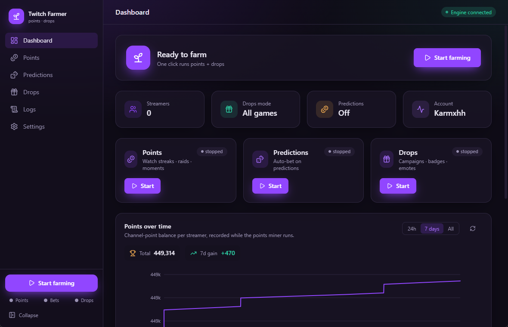

<div align="center">


# Twitch Farmer

**Farm Twitch channel points, predictions and drops from one beautiful window.**

A Windows desktop app in the Aurora family — Rust + Tauri with a liquid‑glass
React UI. It wraps two proven open‑source miners behind one polished interface,
with run‑on‑startup, a system tray, LAN multi‑PC control and a one‑click
per‑user installer.


</div>

---

<div align="center">

</div>

## Features

- 🌌 **Aurora design** — liquid glass over a slowly animated aurora backdrop. Dark / light
  themes, three backdrops, a motion toggle and accent colours (Settings → Appearance).
- 🪙 **Points & predictions** — watch streaks, raids, moments and auto‑bets with strategies
  and filters, plus per‑streamer overrides and a followed‑channels browser.
- 🎁 **Drops** — mine your priority games or every available campaign, badges & emotes
  included, with live per‑drop progress. Campaigns farm even before you link a game
  account — linking is only needed to *claim* the reward.
- 🏅 **Badges** — watch‑time vs subscription badges, what you own, and how each is earned.
- 🖥️ **Multi‑PC** — Twitch Farmer instances discover each other on your LAN; switch to
  another PC from the title bar to view and control it.
- 🔑 **Device‑code login** — no password stored; enter the code the app shows you.
- 🔔 **Notifications** — Telegram, Discord, Webhook, Matrix, Pushover, Gotify.
- 🪟 **System tray** — close / minimize to tray, run on Windows startup, start in tray.
- ⬆️ **Auto‑update** from GitHub Releases, with patch notes shown in‑app.

## Download

Grab the latest installer from the [**Releases**](https://github.com/camwooloo/Twitch-Farmer/releases/latest)
page and run it — installs per‑user, no admin needed. Requires the WebView2 runtime
(preinstalled on Windows 10/11).

## How it works

```
┌────────────────────────────────────────────────────────────┐
│  Tauri shell (Rust)                                          │
│  • system tray · autostart · single-instance · window state │
│  • spawns + supervises the backend on a random localhost     │
│    port with a per-session token                             │
└───────────────┬──────────────────────────┬─────────────────┘
                │ WebView2 (React UI)       │ stdin/stdout
                │  HTTP + WebSocket          ▼
                ▼                  ┌──────────────────────────┐
        http://127.0.0.1:<port>   │  Python backend (frozen)  │
                                  │  aiohttp REST + WebSocket  │
                                  │  ├─ points: rdavydov miner │
                                  │  │   (child process)       │
                                  │  └─ drops: DevilXD core    │
                                  │      headless (child proc) │
                                  └──────────────────────────┘
```

Each miner runs as an isolated **child process** (`--run-miner` / `--run-drops`)
so a crash can't take down the app, and rdavydov's miner gets a real main thread
for its OS signal handlers. The frozen backend re-invokes *itself* for the
children, so no separate Python install is needed on the user's machine.

Config is a single JSON file at `%APPDATA%\TwitchFarmer\config.json`.

## Build from source

Prerequisites: **Python 3.12** (`py -V:3.12`), **Node 18+**, **Rust** (stable),
and the **WebView2 runtime** (preinstalled on Windows 11).

```powershell
# vendored sources already live under backend/vendor (points) and
# backend/vendor_drops (drops). One command does everything:
powershell -ExecutionPolicy Bypass -File build.ps1
```

The installer is written to
`src-tauri/target/release/bundle/nsis/Twitch Farmer_<version>_x64-setup.exe`.

### Dev loop

```powershell
# backend deps once
py -V:3.12 -m venv backend/.venv
backend/.venv/Scripts/python -m pip install -r backend/requirements.txt
# run the app with hot-reload (Rust spawns the venv backend automatically)
npm install
npm run tauri dev
```

## Project layout

| Path | What |
| --- | --- |
| `src/` | React + TypeScript + Tailwind UI |
| `src-tauri/` | Rust shell (tray, autostart, single-instance, backend supervision) |
| `backend/server.py` | aiohttp REST + WebSocket server |
| `backend/engines.py` | points / drops child-process managers |
| `backend/runner.py` | points-miner child entry (builds rdavydov miner from config) |
| `backend/drops_runner.py` + `drops_gui.py` | headless DevilXD adapter |
| `backend/vendor/` · `backend/vendor_drops/` | vendored upstream miners |

## Notes & limitations

- The optional **analytics** web-server needs `pandas`; it's excluded from the
  frozen bundle to keep it small. Install pandas into the backend venv if you
  enable analytics in a dev build.
- Username/password (passport) login for drops is intentionally disabled in the
  headless adapter — **device-code OAuth** is used for both miners.
- Respect Twitch's Terms of Service. This tool is provided as-is.

## License

GPLv3, inherited from both upstream projects.

## Credits

- Points & predictions engine — [rdavydov/Twitch-Channel-Points-Miner-v2](https://github.com/rdavydov/Twitch-Channel-Points-Miner-v2) (GPLv3)
- Drops engine — [DevilXD/TwitchDropsMiner](https://github.com/DevilXD/TwitchDropsMiner) (GPLv3), run headless
- Design system shared with [Aurora Launcher](https://github.com/camwooloo/MCLauncher) and [Aurora PDF](https://github.com/camwooloo/Aurora-PDF)

## License

GPLv3 — see [LICENSE](LICENSE).
